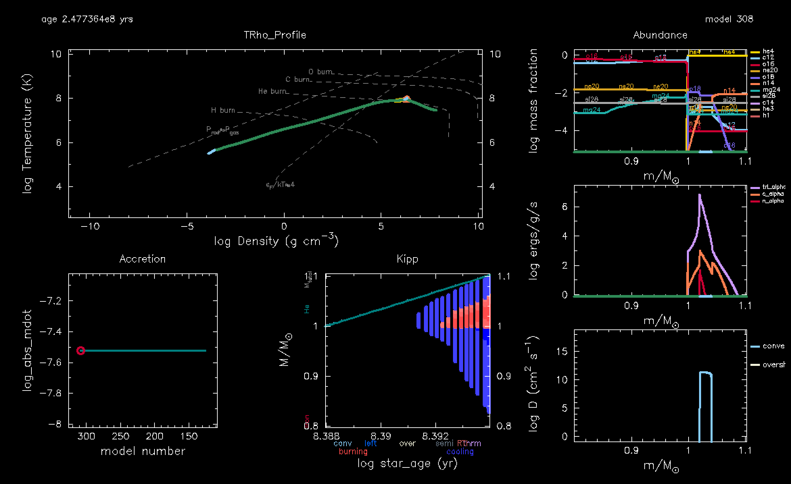

# Introduction 


So far we have pretended that the accretor will happily accept whatever helium we feed it. However, if mass is dumped onto the accretor surface at a rate faster than heat can be transported, the material is compressed and heats up. It is then possible for the helium layer to reach ignition, leading to a helium flash. Historically, the helium flash is of interest to people modeling type Ia supernova progenitors. If the helium shell is sufficiently thick, during the helium flash, the local heating timescale (timescale to heat a fluid element by nuclear burning) can become shorter than the local dynamical timescale (timescale for sound waves to cross a local pressure scale height), yielding a helium detonation. The helium detonation sends a shock wave into the carbon-oxygen core, and can jump-start detonation of the carbon. This "double-detonation" scenario is one of the many proposed channels for forming a type Ia supernova. 
In recent years, there has been a lot more focus on double-detonation during a double white dwarf merger (unstable mass transfer), for example see [Guillochon+2010](https://ui.adsabs.harvard.edu/abs/2010ApJ...709L..64G/abstract). 

We will instead take a walk through history and look at double-detonations due to stable mass transfer. The thickness of the helium shell determines whether a detonation is likely. In turn, the thickness of the helium shell is determined by the mass accretion rate. To develop some intuition, we will first consider constant accretion rates. In lab 3 we will connect these to the actual binary donors that you found in lab 1. 


* * *

# Lab Instructions

For this lab we will be running constant mass accretion onto the accretor in single star MESA. Our goal is to evolve to the He flash in these kinds of systems.

### Some helpful links

[link to the google spreadsheet of options](https://docs.google.com/spreadsheets/d/1__UPg_5JfiBkJpZTleyaSwW_faxHzmo_X7Us2RTfLOM/edit#gid=1651867869)

[link to the github repo](https://github.com/courtcraw/mesadu_wdbinaries)

[link to the MESA documentation](https://docs.mesastar.org/en/latest/)

[Lab 2 solutions if needed](./lab2_solns.md)

## Task 0: Download files
Choose your mass and accretion rate from the [google spreadsheet of options](https://docs.google.com/spreadsheets/d/1__UPg_5JfiBkJpZTleyaSwW_faxHzmo_X7Us2RTfLOM/edit#gid=1651867869), then download the correct WD initial accretor model from <code>initial_accretor_models</code> folder in the [github repo](https://github.com/courtcraw/mesadu_wdbinaries). 

<!-- ### Bonus task: pgstar inlist

You may choose to download the <code>inlist_pgstar</code> file from the [github repo](https://github.com/courtcraw/mesadu_wdbinaries) if you wish. It will contain a nicely formatted pgstar grid for all your viewing needs. Alternatively, you may generate your own if you prefer. We recommend the following panels: Abundances, T-Rho and Mdot vs star age (see history_panels). -->

## Task 1: Generate your inlist
Start by copying the <code>$MESA_DIR/star/work</code> directory to your Lab 2 working directory. Make the following edits to your <code>inlist_project</code> (notice that <code>inlist</code> is only a header file that points to <code>inlist_project</code> and <code>inlist_pgstar</code>).

In <code>star_job</code>:

* Turn off pre-main sequence model generation.
* We will need to set the code to load in the accretor model that you just downloaded. 
* We will set the network (<code>change_initial_net</code>) to <code>co_burn.net</code> for this first part. 
* Set the initial timestep to zero (or 1d-1). 
* Ensure pgstar output is on (it should be on by default).
* Optional (recommended): instruct the model to pause before it terminates so you can view the pgstar output before closing

<hint><details>
<summary> Hint (click here) </summary><p>
Search for the following in the MESA Documentation: <code>load_saved_model</code>, <code>change_initial_net</code>, <code>set_initial_dt</code>, <code>pgstar_flag</code>, and <code>pause_before_terminate</code>
</p></details></hint>
<br>

In <code>controls</code>: 

* Turn off the initial mass and initial z that come with the default <code>work</code> directory. 
* Change the stopping condition. We want to stop when the power generated by helium burning is greater than 10^4 solar luminosities. In other words, we want to put an upper limit on he-burning power at L_He = 10^4 Lsol. (See the hint below if you can't find the inlist keyword for this)
* Turn on the Ledoux criterion. 
* Add in your constant mass accretion from the spreadsheet (this will be called simply <code>mass_change</code>).
* Edit the mesh resolution, adjust the timestep limit, tell the code what to accrete, and update the solver using this code snippet:
```
! mesh
     mesh_delta_coeff = 1.2d0
! timesteps
     delta_lgL_He_limit = 0.02d0 !0.025d0
! accretion
     xa_function_species(1) = 'he4'
     xa_function_weight(1) = 0 
     xa_function_param(1) = 1d-2
! solver
     energy_eqn_option = 'eps_grav'
     max_resid_jump_limit = 1d20 
     make_gradr_sticky_in_solver_iters = .true.
```

<hint><details>
<summary> Hint (click here) </summary><p>
Search for the following in the MESA Documentation: <code>power_he_burn_upper_limit</code>, <code>use_ledoux_criterion</code>, and <code>mass_change</code>
</p></details></hint>
<br>

### Bonus Task: extra output

As a bonus task, you may choose to add a history column to your output that calculates the thickness of the helium shell as it is accreted. It can be easily calculated after the run is finished, so you will not be in trouble if you don't complete this task. 

Call the new history column <code>he_shell_mass</code>, and it can be calculated in many ways. A few suggestions are <code>star_mass - co_core_mass</code>, <code>star_mass - initial_mass</code>, or <code>mass_change * star_age</code> (remember mass_change is in Msun/yr and star_age is in yrs). The first option contains only variables contained in <code>star_ptr</code> whereas the second two will require you to define a constant value. 


## Task 2: Inlist pgstar

for your <code>inlist_pgstar</code>:

We have provided a nice <code>inlist_pgstar</code> file in the [github repo](https://github.com/courtcraw/mesadu_wdbinaries) which you may download and use. It will contain a nicely formatted pgstar grid for all your viewing needs. You'll need to adjust a few options within the file:

* The first commented chunk will instruct you to change the <code>[plot]_xmin</code> value (in solar masses) for the four plots. You should adjust this value to the size of your chosen accretor model, but slightly smaller, so that you can monitor the growth of the helium shell.
* The second commented chunk has two options to choose between depending on if you did or did not do the previous bonus task (creating the <code>he_shell_mass</code> history column). The default will assume you have not done this bonus task. If you did complete the bonus task, you should switch to the other one. The only difference is that the second one will plot both the accretion rate and the <code>he_shell_mass</code>, and the default option will plot only the accretion rate.

This <code>inlist_pgstar</code> will create a Kippenhahn diagram so don't forget to copy over the <code>history_columns.list</code> defaults and uncomment the <code>mixing_regions</code> and <code>burning_regions</code> lines.


## Task 3: clean/make/run

Now go ahead and compile and run your model. At first you should see very little change, but start by watching the T-Rho diagram. You'll notice the envelope start to increase in temperature as the accretion heats up the outer layers (this is called shock heating). You'll then see a small bump in the T-Rho diagram that will move towards the center of the star. Eventually this bump will increase past the Helium ignition line in the T-Rho diagram and the Power and Kippenhahn plots will begin changing. At this point you should also see the abundance profile changing as Helium rich material is accreted. Your model will terminate soon after ignition. Below is an example of what you should see at the end of a run.

Upon completion of the run, record your helium shell thickness at ignition and the time of helium ignition to [the google spreadsheet](https://docs.google.com/spreadsheets/d/1__UPg_5JfiBkJpZTleyaSwW_faxHzmo_X7Us2RTfLOM/edit#gid=1651867869). Remember that the model will stop running at helium ignition, so this is simply the final values from your history files.

<hint><details>
<summary> Hint (click here) </summary><p>
The helium shell thickness is <code>star_mass - co_core_mass</code>
</p></details></hint>
<br>




<!-- Upon completion of the run, record your helium shell thickness at ignition and the time of helium ignition to [the google spreadsheet](https://docs.google.com/spreadsheets/d/1__UPg_5JfiBkJpZTleyaSwW_faxHzmo_X7Us2RTfLOM/edit#gid=1651867869). Remember that the model will stop running at helium ignition, so this is simply the final values from your history files.

<hint><details>
<summary> Hint (click here) </summary><p>
The helium shell thickness is <code>star_mass - co_core_mass</code>
</p></details></hint>
<br> -->

## Task 4: Create a new reaction network

#### A bit of nucleosynthesis background

Definitions:
* The greek letter alpha $$\alpha$$ is often used to refer to a Helium nucleus ($$^{4}He$$), and in MESA will often be referred to as simply <code>a</code>.
* The greek letter gamma $$\gamma$$ refers to the energy (a photon) generated by a reaction, and in MESA will often be referred to as simply <code>g</code>.
* The greek letter nu $$\nu$$ refers to a neutrino, and reactions using this are often referred to as "weak" reactions.
* The letter $$n$$ refers to a neutron, and in MESA will often be referred to as <code>neu</code> or <code>n</code>.
* We will use $$e^-$$ to refer to electrons, and in MESA this is usually <code>e</code>.
* Isotopes are referred to with this notation $$^{\#}X$$ where X is the chemical symbol and \# is the mass number. However, in MESA internals, these are usually referred to more simply as <code>x#</code>. As an example, the Carbon-12 isotope can be written as $$^{12}C$$, but in MESA it will be called <code>c12</code>.

Finally, we will use reaction notation in the instructions. If you are unfamiliar, it is a compact notation used to describe nuclear reaction. Reactions which we might normally write as:

$$A + b \rightarrow D + c$$

You could then write more compactly as:

$$A(b,c)D$$

So as an example, the following alpha-capture reaction on $$^{12}C$$ to create $$^{16}O$$ and energy:

$$ ^{12}C + \alpha \rightarrow ^{16}O + \gamma $$

is equivalently written as:

$$ ^{12}C(\alpha,\gamma)^{16}O $$

<!-- And in MESA internals, this will be written as <code>r_c12_ag_o16</code>. -->
In general, MESA doesn't use a standard notation for reactions, but in the networks there will usually be a comment explaining exactly reaction they mean if there is any ambiguity.

#### The actual task

Now, we will run the same inlists but with a new reaction network of our creation. We will generate our own reaction network that includes the "NCO" reaction chain ($$^{14}N(e^-,\nu)^{14}C(\alpha,\gamma)^{18}O$$) and also adjust the reaction rate for $$^{14}C(\alpha,\gamma)^{18}O$$. 

[There is detailed network documentation in the MESA Docs which you may refer to](https://docs.mesastar.org/en/latest/net/nets.html)

Up until now we have been using the reaction network called <code>co_burn.net</code>. Navigate to <code>$MESA_DIR/data/net_data/nets</code> to view the source files for all of the available reaction networks. Start by opening <code>co_burn.net</code> and viewing its contents. You'll see that it contains very little information, and instead points to two other files. Open and examine those other files. You'll see that these other two files have much more information in them. Refer to the docs to see how the functions <code>add_isos()</code> and <code>add_reactions()</code> work.

Recommended: If you'd like for your MESA run to print out its net information at start (for example to check if it's implementing your new reactions!), you can add the following to the <code>star_job</code> section of your inlist:
```
show_net_species_info = .true. ! to list all of the isotopes in the net
show_net_reactions_info = .true. ! to output information on all net reactions
list_net_reactions = .true. ! to output a simple list of all the reactions in your net
```

Now lets generate our own reaction network. Begin by copying <code>co_burn.net</code> to your lab 2 working directory and giving it a new name, something like <code>nco.net</code>. Decide which isotopes you'll need to add in for the NCO reaction, either by examining <code>co_burn.net</code> and its constituent files or by outputting the net data to the terminal. Add those isotopes to the reaction network using <code>add_isos_and_reactions()</code>. This will automatically add all reactions associated with those isotopes as well. 

<hint><details>
<summary> Hint (click here) </summary><p>
The two isotopes you will need are <code>c14</code> and <code>o18</code>
</p></details></hint>
<br>

Now we'll update the reaction rate for $$^{14}C(\alpha,\gamma)^{18}O$$. Download the zip file called <code>tables_hashimoto.zip</code> from the [github repo](https://github.com/courtcraw/mesadu_wdbinaries). If you unzip this file, there will be a folder called <code>tables_hashimoto</code> which you should place inside your Lab 2 work directory. Now add the following section to the <code>star_job</code> section of your inlist:

```
  ! adjusting nuclear reaction rates
    rate_tables_dir = 'tables_hashimoto'
    rate_cache_suffix = 'hashimoto'
```

If you look inside the file <code>tables_hashimoto/rate_list.txt</code> you will see this:

```
! this is an example of a rates list file for use with mesa/rates
! the mesa/data/net_data/rates directory has sample rate files
! pairs of rate name and rate file

r_c14_ag_o18   'c14rate_Hashimoto_reduced.txt'
```

The last line here indicates that the rate for the $$^{14}C(\alpha,\gamma)^{18}O$$ reaction will be read from a file called <code>c14rate_Hashimoto_reduced.txt</code> which also lives in the folder called <code>tables_hashimoto</code>. Opening this file will reveal a simple two column file that MESA will read to load the new reaction rates. You may also inspect <code>tables_hashimoto/weak_rate_list.txt</code> which works similarly. See the documentation for further info.


## Task 5: clean/make/run

Recompile and run your new model. When you run this model, if you've chosen to output your net data, it would be good to check that you are properly including your newly added elements. If you have not output net data, you can check the abundance panel in the pgstar output to see if there is a line for $$^{18}O$$ that appears.

Upon the run's completion, record your helium shell thickness and the time of helium ignition to [the google spreadsheet](https://docs.google.com/spreadsheets/d/1__UPg_5JfiBkJpZTleyaSwW_faxHzmo_X7Us2RTfLOM/edit#gid=1651867869).

As everyone finishes their models, we can ask: how does the Helium shell thickness at ignition vary with accretion rate and accretor mass, and how does changing the reaction networks change these values?

## Lab Extension (over lunch)

If you would like to view what happens after helium ignition, you can turn off the stopping condition in the inlist and allow your model to run over lunchtime. You will see very interesting things happening in your T-Rho diagram! If you haven't, we highly recommend adding <code>pause_before_terminate = .true.</code> to the <code>star_job</code> section of <code>inlist_project</code> so that you can view the pgstar output when you return from lunch. Below is a video of what you should see, in case you decide not to run this.


* * *

# Solutions

If you need any solutions for Lab 2: you can find them [here](./lab2_solns.md)


[Back to main page](./)