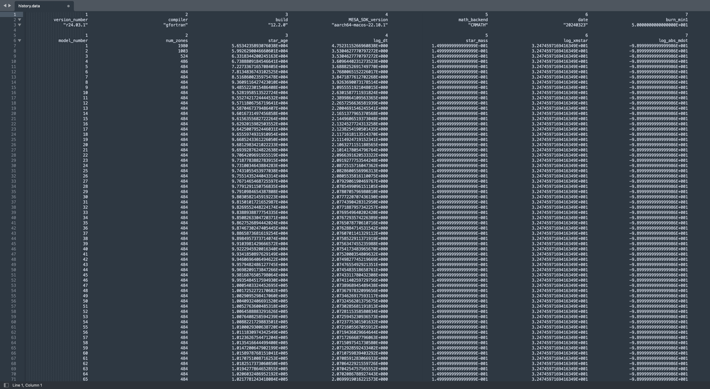

[link to the google spreadsheet for lab 3](https://docs.google.com/spreadsheets/d/1__UPg_5JfiBkJpZTleyaSwW_faxHzmo_X7Us2RTfLOM/edit#gid=2060915946)

# (More) Realistic(ish) Mass Transfer onto a WD accretor

This is the background info about cool stars and why and physics and stuff... 

# Lab Instructions
For this lab, we will use run_star_extras to interpolate the Mdot from Lab 1 and ultimately measure a more-realistic thickness of the Helium shell (as compared to our values from Lab 2)
<br>


### Task 0. Project Setup 
This lab will combine the work we have done so far in labs 1 and 2. To ease the set up process, we will be continuing from the end point of Lab 2. Make a clean copy of your directory from Lab 2 then copy over the binary_history file generated in Lab 1. If you didn't complete Lab 2 for any reason, you may instead download the Lab 2 solutions from the [github repo](https://github.com/courtcraw/mesadu_wdbinaries).

<div class="filetext-title"> The Lab 3 starting directory should contain these files </div> 
<div class="filetext"><p>
inlist_project
inlist_pgstar
inlist
nco.net
binary_history.data
cowd_< >M_Tc2e7.mod
tables_hashimoto/
src/
make/
mk
clean
re
rn
</p></div>


### Task 1. Writing the interpolation Code
Open <code>run_star_extras.f90</code> and take a look through the file. The code is establishing a new module <code>run_star_extras</code>, using a set of other modules found in other files, then including a standard set of subroutines from <code>'standard_run_star_extras.inc'</code>. <code>'standard_run_star_extras.inc'</code> can be found at <code>$MESA_DIR/star/job/standard_run_star_extras.inc</code>. Replace the include statement with the contents of that file, then check that the code compiles. This compilation step ensures that the copy was clean. If you wish to have a more scaffolded approach to this lab, you can download a partially annotated version of <code>run_star_extras.f90</code> from the github repo [here](https://github.com/courtcraw/mesadu_wdbinaries)

Recall the control flow in MESA (below), that is, which routines get called at which points during a MESA run. Identify which subroutine (or function) would need to be modified in order to interpolate the varying mdot produced in Lab 1 and find that routine in <code>run_star_extras</code>. Remember, this interpolation will need to be completed before MESA attempts to solve the star's state.  


* Note: This diagram can be found in the MESA Documentation [here](https://docs.mesastar.org/en/latest/using_mesa/extending_mesa.html#control-flow)

Look through the subroutines in <code>run_star_extras</code> and observe their general form. A subroutine (or function) is named, variables are declared, the error status is set and checked, the "stuff" of the subroutine occurs, then the subroutine ends. Since we have just identified the function we will be modifying, let's take a look at the variables we will need. Open the donor history file, <code>binary_history.data</code> and take a look around. How many columns are before the mdot (log_abs_mdot)? How many rows before our relevant data begins? 

If all is according to plan, you should notice six (6) labeled columns before <code>log_abs_mdot</code>, and six (6) header rows before data begins. Below is an example of the structure of this <code>binary_history.data</code> file, note that the particular data may vary. 



When opening the file, our interpolation function will read the contents row by row. This allows us to easily skip the header section (we will worry about this later). However, on a given row, we will only need <code>star_age</code>, <code>log_dt</code>, and <code>log_abs_mdot</code>, and so need places to dump the irrelevant data that is intertwined. This can be done by establishing placeholder variables that we can set and ignore throughout the calculation. Take note of the order and data type for the columns. 

Navigate back to <code>run_star_extras</code> and initialize some variables. We will use a <code>log_Mdot_interp</code> as an intermediate variable in our calculation whose type is real, a counter integer <code>i</code>, and 2-dimensional arrays for <code>star_age</code>, <code>log_dt</code>, and <code>log_Mdot</code>. These declarations should be done above the statement <code>ierr=0</code>, but order does not matter. Remember to format the declarations correctly as <code>type :: name</code> and don't forget to add in the necessary placeholder variables, <code>placeholder_i</code> and  <code>placeholder_r</code>.

An example of some of variable initializations is below. Feel free to read more about Fortran arrays [here](https://web.stanford.edu/class/me200c/tutorial_90/07_arrays.html). Another good resource for Fortran90 basics is [this](https://pages.mtu.edu/~shene/COURSES/cs201/NOTES/F90-Basics.pdf)
```
! Add Variables
integer :: i
real(dp), dimension(2) :: star_age
real(dp) :: log_Mdot_interp 
```

<hint><details>
<summary> Hint (click here) </summary><p>
These changes should be in <code>extras_start_step</code> 
</p></details></hint>

<hint><details>
<summary> Hint (click here) </summary><p>
The types used are <code>integer</code>, <code>real(dp)</code>, and <code>real(dp), dimension(2)</code>
</p></details></hint>
<br>

Now that we have wrangled our variables, we need to tell Fortran to open the binary_history.data file. Use your profound access to all of human knowledge to find the function that connects an external file to an input/ouput unit (ie. Google it or control-F [here](http://www.ndp77.net/dnld/Lahey_LaheyF90LR.pdf)). Set <code>unit=33</code>, <code>file = '< local path to binary_history.data >'</code>, and <code>action='read'</code>. Remember to write this after the error check, beneath <code>extras_start_step = 0</code>. 

* Note: The unit refers to a Fortran logical unit, the interface for data transfer in Fortran. The unit number we chose (33) was largely arbitrary and chosen for consistency, not necessity. The only rule here is that the value needed to be a nonnegative integer.

<hint><details>
<summary> Hint (click here) </summary><p>
<code>
!! open file <br />
open(unit=33, file='history.data', action='read')
</code>
</p></details></hint>

With the interface to the file established, let's make sure to skip through that header that we saw earlier. Remember how many rows were in the header? Create a do loop that reads the file (henceforth '33'), but does nothing for those first header rows. This "nothing" can be accomplished by simply reading the row, but not establishing any variables for the data to read to. Look through the prior resources to find the format of this read statement. Also, the format for these header rows varies, so use <code>*</code> to denote an automatic format assignment, called list-directed formatting. 

The Do loop should have the form:
```
do i = 1, < upper bound >
  func()
end do
```

<hint><details>
<summary> Hint (click here) </summary><p>
The upper bound should be the number of header rows, six (6)
</p></details></hint>

<hint><details>
<summary> Hint (click here) </summary><p>
The format for the read statement is <code>read(33, *)</code>
</p></details></hint>
<br>

Now that we made it through that pesky header, it's time to get that mdot! Since the data from here on will follow a standard patten, let's set a format for the file contents. This is also for consistency/practice, not necessity, as format can be automatically assigned (list-directed) with <code>*</code>.
```
! Set Format for file contents
101 format(2(i40, 1x),5(1pes40.16e3, 1x))
```

<hint><details>
<summary> Bonus (click here) </summary><p>
What do i40 and 1pes40.16e3 mean? What format are we setting here?
</p></details></hint>
<br>

Once we have an established format we can read in the history contents. Start a Do loop and read in the first seven values from the history file. Note, <code>read()</code> always starts on a new line when executed and will transfer the data in column order. ave the star age, log dt, and log mdot from the history file to the second column of our fortran arrays and remember to use the right placeholder!

<hint><details>
<summary> Hint (click here) </summary><p>
The read function takes the form: read(file, format) variable_list
</p></details></hint>

<hint><details>
<summary> Hint (click here) </summary><p>
To access the second column of the fortran array use (2) following the variable name (e.g. <code>star_age(2)</code>)
</p></details></hint>

<hint><details>
<summary> Hint (click here) </summary><p>
<code>read(33,101) placeholder_i, placeholder_i, star_age(2), log_dt(2), placeholder_r, placeholder_r, log_Mdot(2)</code>
</p></details></hint>
<br>

Recall that we used a counter in our first Do loop to skip the header, but have omitted one here. Instead, this 'do' will function as a traditional While loop, operating until we give the command to exit. Our goal is, again, to get the Mdot at a particular age of the star. This age will increase each iteration of the loop, as the next line in the history file is read. Write an if-statement to exit the loop when the current star age is reached, else save the star_age(2), log_dt(2), and log_mdot(2) values to the other column (1) of their arrays. Note, the current star parameters are given by the star pointer, <code>s%</code>. 

<hint><details>
<summary> Hint (click here) </summary><p>
The format for if/else in Fortran is:<br />
if (condition) then<br />
else<br />
endif<br />
</p></details></hint>

<hint><details>
<summary> Hint (click here) </summary><p>
Exit the do loop with <code>exit</code>
</p></details></hint>

<hint><details>
<summary> Hint (click here) </summary><p>
The condition is <code>star_age(2) > s% star_age</code>
</p></details></hint>
<br>


End the do loop, close the file, and add the following lines to limit the next timestep. This ensures that the next step taken is the lesser of the current expected timestep and the timestep used in the donor evolution. This improves our result and limits the model from interpolating over outsized timesteps. 
```
!! LIMIT DT
s% dt_next = min( s% dt_next, exp10(log_dt(1)) * secyer )
```
<hint><details>
<summary> Hint (click here) </summary><p>
<code>end do </code><br />
<code>close(33) </code>
</p></details></hint>
<br>

Due to the exit statement we placed in the Do loop, it is possible that we lack the information necessary to complete the interpolation. This occurs when our model has not reached the beginning age of the history file. Before we waste time interpolating NaN values, how can we check that at least two rows have been read?

When variables are initialized, their values are considered NaN (Not a Number) until assignment. We can use this fact to our advantage. Following IEEE standard, NaN /= NaN in Fortran, meaning no two NaN's are the same. If two rows have been read, then we will have successfully moved data in one of the variable arrays from the second column (2) to the first column (1). Until then, the first column (1) will remain a NaN value. This will serve as the logic behind our check. 

If we have read two rows of the history file, <code>log_Mdot(1)==log_Mdot(1)</code> will evaluate True. Otherwise the unset NaN's will not equal each other, evaluating False. Add this if statement to our script:
```
!! Check that at least two history rows have been read (the variables will be NAN if not)
if (log_Mdot(1)==log_Mdot(1)) then
    !! interpolate m_dot (linear)       

    !! set the m_dot value 

endif
```

Finally, we can write the linear interpolation for m_dot using the variables we have assigned and set the Mdot value for the star at each timestep. Follow the standard form of a linear interpolation of X (star age) and Y (Mdot). Once complete, clean/mk to check for any errors. 

<hint><details>
<summary> Hint (click here) </summary><p>
The form of the linear interpolation is <br /> <br />
Y = Y_0 + ((Y_1 - Y_0)/(X_1 - X_0)) * (X - X_0) <br />
,where Y is the Mdot and X is the star age.
</p></details></hint>

<hint><details>
<summary> Hint (click here) </summary><p>
The variable names to complete the interpolation are:<br />
Y = log_Mdot_interp<br />
X = s% star_age<br />
Y(0) = log_Mdot(1)<br />
Y(1) = log_Mdot(2)<br />
X(0) = star_age(1)<br />
X(1) = star_age(2)<br />
</p></details></hint>

<hint><details>
<summary> Hint (click here) </summary><p>
The variable for m_dot is <code>s% mass_change</code>
</p></details></hint>

<hint><details>
<summary> Hint (click here) </summary><p>
<code>s% mass_change = exp10(log_Mdot_interp)</code>
</p></details></hint>
<br>


### Task 2. Measuring the accretor at Helium flash
Run the model. Was it successful? If not, note the reason for the error. 

You should have received a Fortran runtime error pointing back to our run_star_extras modifications from Task 1. Recall that we are attempting to trace through a history file based on the current age of the star. At the same time, however, MESA is loading a saved model, treating it as the current star, and running through the entire history file before a step can occur. Let's make some modifications to <code>inlist_project</code> to remedy this. Set the initial age and model numbers to 0, then delete (or comment out) the accretion rate. 

Run the model (don't forget to clean and make). During the model's evolution, you should see a "lump" form that grows and ignites. Where is this "lump"?

Once the model has completed, open the history.data log. Use the data to find the rotation rate at the helium flash. Assume the accretor rotates as a solid body. Record this rotation rate, Helium shell thickness, and the time to Helium flash in [the google spreadsheet](https://docs.google.com/spreadsheets/d/1__UPg_5JfiBkJpZTleyaSwW_faxHzmo_X7Us2RTfLOM/edit#gid=1651867869). Compare the Helium shell thickness and time to Helium flash with the results from Lab 2. 

<hint><details>
<summary> Hint (click here) </summary><p>
Jdot = sqrt(GMR) * Mdot
</p></details></hint>

<hint><details>
<summary> Hint (click here) </summary><p>
Delta_J = Jdot * s% dt
</p></details></hint>

<hint><details>
<summary> Hint (click here) </summary><p>
rotation rate = Delta_J / I
</p></details></hint>

<hint><details>
<summary> Hint (click here) </summary><p>
The moment of inertia, I, of a solid sphere is (2/5)MR^2
</p></details></hint>
<br>


### Bonus Task. Exploring timescales


# BONUS. Evolutionary Timescale
<task><details><summary>Plot the density vs temperature of the constant case</summary></details></task>
<task><details><summary>Plot the density vs temperature of the varying case</summary></details></task>
<task><details><summary>Compare to Bauer Fig 8</summary></details></task>
* Expand out


* * *


[Back to main page](./)