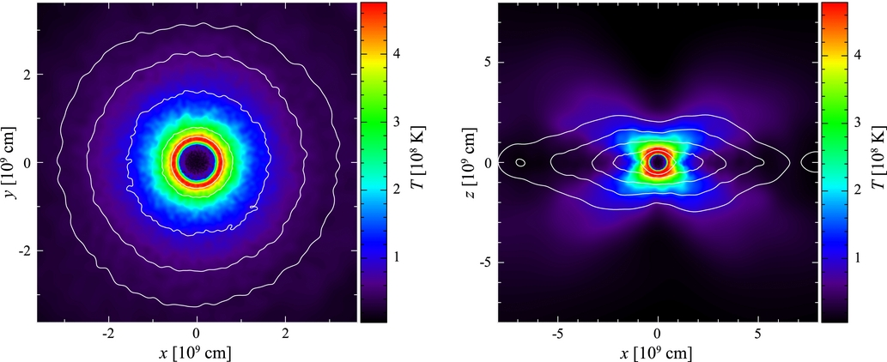

Due to runtimes and time constraints, we were not able to include this case in our main labs, but after a few requests, we've left a short (untested!!) writeup of a bonus lab here for you. This lab might be really bad!! If so, we are not liable :p

This lab, and this work in fact, has been the product of many previous MESA schools (one unofficial school even). 

[Ken Shen Lab from 2016](https://zenodo.org/records/2603640)
[Bill Wolf Maxilab 3 in 2021](https://billwolf.space/projects/massive_binaries_2021/#part3)
[Also Brad Munson lab in 2022, published in his 2022 paper](https://zenodo.org/records/6971328)

# Modelling a WD Merger in MESA - the R Coronae Borealis Stars

As we mentioned in the beginning of Friday's Lab 1, DWDs are very important systems, and their mergers can form either Type 1a SN (in the high-mass case) or a post-merger star (in the low-mass case). In fact, these low-mass mergers have been theorized to be the formation method for the rare R Coronae Borealis (RCB) type variables, or more generally the Hydrogen-deficient Carbon (HdC) stars. This lab will walk you through the methodology that we currently use to model post-merger stars, and specifically the HdC stars.

Some recent literature on HdC modeling: 

* [Wong+ 2024](https://ui.adsabs.harvard.edu/abs/2024ApJ...962...20W/abstract)
* [Munson+ 2022](https://ui.adsabs.harvard.edu/abs/2022ApJ...939...45M/abstract)
* [Crawford+ 2020](https://ui.adsabs.harvard.edu/abs/2020MNRAS.498.2912C/abstract)

For the record, there are older models of RCB stars which use MESA's accretion, however they are on a quite old version. (cite) Maybe we will revisit this someday! (foreshadowing...)

* * * 

# Part 1 - Entropy injection

In order to model a WD merger, we actually choose to stellar engineer rather than using the binary module or modelling single star accretion. You did some stellar engineering in the tuesday lab this week, but in this case we mean that we are going to use non-physical processes in `run_star_extras.f90` to create a temperature-density profile that resembles the profile of a post-merger object created in 3D hydrodynamical simulations.

Here's a plot from [Dan 2011](https://ui.adsabs.harvard.edu/abs/2011ApJ...737...89D/abstract) which shows the type of structure we are looking for. This is a 2D density profile showing that the post-DWD-merger star has an isothermal core, which is essentially an untouched CO-WD, and the envelope has a hot shell at its base, and consists of the fully-mixed material from the He-WD. 



## Task 0 - Download your files

Go ahead and download the zip file directory from <a href="" target="_blank">the github repo (direct link)</a>. As this is an optional lab and the runtime is quite long, this writeup will explain the inlists and what they do, rather than having you make any edits to the files.

## "Task 1" - evolving a normal star with no physics

The task here is in quotes because we wont actually be running MESA for awhile, as the run script in the working directory will run 3 inlists in succession. Rather we'll use this task to explain what the code does.

The first thing we need to do to model these stars is to create a normal star with a degenerate core. This star will have a mass equivalent to the total mass of the DWD merger, aka the CO-WD mass + He-WD mass. In our case, this will be 0.8 M_sun, equivalent to a 0.55 Msun CO-WD + 0.25 Msun He-WD. However, we don't need a lot of normal physics in this evolution, as everything will be changed in later steps. 

Go ahead and open `inlist_engrcb1`. This is the first inlist we'll run. In the `&star_job` section you'll see this

```
&star_job
!-------------------------------------------------------------------------------
! controls to save a model at the intermediate point and to restart
! uncomment the "load_saved_model" to restart from the intermediate model
!-------------------------------------------------------------------------------
      save_model_when_terminate = .true.
      save_model_filename = 'RCB1.mod'

!-------------------------------------------------------------------------------
! display on-screen plots and pause before termination
!-------------------------------------------------------------------------------
      pgstar_flag = .true.
      !pause_before_terminate = .true.

      change_net = .true.
      new_net_name = 'rcb.net'
      change_initial_net = .true.

/ ! end of star_job namelist
```

So you'll see that we are saving a model file called `RCB1.mod`, and using a new custom reaction rate called `rcb.net`. If you close the inlist and instead inspect `rcb.net`, you'll see this:

```
add_isos_and_reactions(
   neut
    h  1  2 ! hydrogen
   he  3  4 ! helium
   li7      ! lithium
   be7
   be  9 10 ! berylium
    b8      ! boron
    b11
    c 11 14 ! carbon
    n 13 15 ! nitrogen
    o 14 18 ! oxygen
    f 17 19 ! fluorine
   ne 18 22 ! neon
   na 21 24 ! sodium
   mg 23 26 ! magnesium
   fe56
   )
```

This network was made by copying the default network called `mesa75.net` and removing a set of high atomic number isotopes, as well as adding in Beryllium-7 and Boron-11. This is a rather large network, but many of these elements are important for correctly modelling the surface abundances of HdC stars. 

In the `&controls` section of `inlist_engrcb1` You'll see the following:

```
&controls

!-------------------------------------------------------------------------------
! turn off nuclear burning
! keep this turned off throughout
!-------------------------------------------------------------------------------
      max_abar_for_burning = -1

!-------------------------------------------------------------------------------
! specify initial mass in Msol units
! choose a mass between 0.5 and 1.1
!-------------------------------------------------------------------------------
      initial_mass = 0.8

!-------------------------------------------------------------------------------
! terminate at an intermediate point when core is degenerate: eta = 5
! eta ~ electron chemical potential / (k*T)
! switch this flag off after saving the intermediate model
!-------------------------------------------------------------------------------
      eta_center_limit = 5d0

/ ! end of controls namelist
```

This is a very barebones inlist. We begin by turning off nuclear burning using `max_abar_for_burning = -1`, specify the initial mass which in our case is 0.8 M_sun (remember this is the total mass of the binary), and then set the stopping condition, which is `eta_center_limit = 5d0`. So what we are doing is evolving a 0.8 M_sun star without any nuclear reactions until it has a degenerate core. At the end this inlist will save a model and move on to the next inlist, which is `inlist_engrcb2`.

## "Task 2" - changing the abundance profile

Now that we have a star with a degenerate core, we can change its abundances. These abundances will be those of a CO-WD in the core (0-0.55 M_sun) and those of a mixed He-WD in the envelope (0.55-0.8 M_sun). This step will also cool the star a little bit, to cool down the core.

If you open `inlist_engrcb2` and inspect the inlist you will see:

```
&star_job

!-------------------------------------------------------------------------------
! controls to save a model at the intermediate point and to restart
! uncomment the "load_saved_model" to restart from the intermediate model
!-------------------------------------------------------------------------------
      save_model_when_terminate = .true.
      save_model_filename = 'RCB2.mod'
      load_saved_model = .true.
      load_model_filename = 'RCB1.mod'

!-------------------------------------------------------------------------------
! flag to relax composition, which is specified in controls
! turn this on when restarting
!-------------------------------------------------------------------------------

      relax_initial_composition = .true.
      num_steps_to_relax_composition = 100
      relax_composition_filename = 'abund_single_zone_subZ_newrun2.dat'

!-------------------------------------------------------------------------------
! display on-screen plots and pause before termination
!-------------------------------------------------------------------------------
      pgstar_flag = .true.
      !pause_before_terminate = .true.
      
      change_net = .true.
      new_net_name = 'rcb.net'
      change_initial_net = .true.      
      
/ !end of star_job namelist
```

The beginning is model loading and saving, which you've dealt with extensively, and the last section turns on pgstar and changes the reaction network, which you've also dealt with. The middle chunk tells the code to change the initial composition to a profile described in `abund_single_zone_subZ_newrun2.dat` over 100 timesteps.

`abund_single_zone_subZ_newrun2.dat` is a file that comes from [Munson 2022](https://zenodo.org/records/6971328), who has already calculated the CO-WD and He-WD abundances. The file has the format

```
1000 40
1.000000000000000020e-99 6.040004452762878548e-16 4.140004827901682836e-05 5.445396760186261385e-16 3.211065290350120970e-08 9.929072682165802632e-01 1.748258400987545213e-17 1.975694662392382818e-16 1.040564287002447785e-15 1.238709535603764856e-23 4.977850378419794081e-24 6.973274065271166072e-15 4.719543313693083831e-12 2.849825380154704215e-04 1.937918494140409209e-03 9.278936376290274329e-05 1.870732295459317734e-07 2.371368737198171865e-03 1.625360614158644607e-07 2.063274113911187476e-11 3.227932702068688953e-07 2.012186418634712842e-03 1.734875081337317477e-05 7.174854463170876842e-10 3.675758592394827933e-09 1.783680353065121994e-09 1.668430952878864076e-09 6.524391011110503079e-17 7.159407485004767650e-15 9.483623689168143992e-05 6.084407396571768279e-06 1.254508455814700306e-05 1.242726821712417994e-12 2.684822875335599118e-11 1.053432088831084293e-05 8.977675863637433732e-08 5.716346988661850945e-15 3.232683939613847506e-05 4.380922214625487418e-06 5.103505725782985233e-06 1.681910025494979285e-04
...
```

Where the first line of numbers indicates the number of zones and the number of isotopes in the network. The rest of the lines are the abundances per zone, with the first value indicating the `logxq` of that zone.

`&star_job` of `inlist_engrcb2` reads:

```
!-------------------------------------------------------------------------------
! turn off nuclear burning
! keep this turned off throughout
!-------------------------------------------------------------------------------
      max_abar_for_burning = -1


!-------------------------------------------------------------------------------
! terminate when central temperature of cooling WD reaches 2e7 K
! turn this flag on after the restart
!-------------------------------------------------------------------------------
      log_center_temp_lower_limit = 6.9 !7.30103d0

	photo_interval = 1
	history_interval = 1
	profile_interval = 1

/ ! end of controls namelist
```

So burning is still off, and now we stop when the model cools a little bit (after relaxing the composition).

## "Task 3" - internal structure adjustment using other_energy

Now for `inlist_engrcb3` where the meat of the stellar engineering process lives. This is the step where we are going to adjust the structural profile. Below is a plot from [Lauer+ 2019]() which shows the difference in the structural profile before and after this process.


To do this, we will use the `other_energy` hook in `run_star_extras.f90`. If you open the `src/run_star_extras.f90` file in this directory, there will be a subroutine that looks like this:

```fortran
      subroutine entropy_injection_routine(id, ierr)
        use const_def, only: Msun
        use auto_diff
         integer, intent(in) :: id
         integer, intent(out) :: ierr
         type (star_info), pointer :: s
         integer :: k, k_core, He, C, O
         double precision :: trel, mtransition, etatransition, highentropy, lowentropy, tempWD, alpha, s_targ, m_core, m_shell
         !type(auto_diff_real_4var_order1) :: 
         
         
         ierr = 0
         call star_ptr(id, s, ierr)
         if (ierr /= 0) return

         ! set the timescale to relax the entropy profile to be short,
         ! so that there isn't time for thermal transport
         ! or convection to mess up the desired profile
         trel = s% x_ctrl(5)

         ! loop through the zones and relax the
         ! entropy profile to the desired values
         ! this particular parametrization is definitely not fundamental
         ! it's just meant to mimic the entropy equation in such a way
         ! that the extra heating or cooling has a vaguely appropriate magnitude
         highentropy = s%x_ctrl(2)
         mtransition = s%x_ctrl(1)*Msun
         lowentropy = s%x_ctrl(3)
         etatransition = s%x_ctrl(4)
         tempWD = s% x_ctrl(6) !3.325d7
         alpha = s% x_ctrl(7)
         m_core = s% x_ctrl(8)*Msun
         m_shell = s% x_ctrl(9)*Msun
         !Find index for specific species
         do k = 1, s%species, 1
            if (chem_isos% name(s% chem_id(k)) == "he4") then
               He = k
            end if
            if (chem_isos% name(s% chem_id(k)) == "c12") then
               C = k
            end if
            if (chem_isos% name(s% chem_id(k)) == "o16") then
               O = k
            end if
         end do
	 !Find index of core as defined by chemical boundary
         do k = 1, s%nz
            if (s% xa(He,k) .lt. .99*s%xa(He,1)) then
               k_core = k
               exit
            end if
         end do

         m_core = s%m(k_core)
         lowentropy = exp(s%lnS(k_core))

         do k = 1, s% nz

            if (s% m(k) .ge. m_core .and. s% m(k) .le. m_shell) then
               s% extra_heat(k) = ( ((exp(s%lnS(k_core))-highentropy)/(m_core-m_shell))*(s%m(k)-m_core)+lowentropy - exp(s%lnS(k)) ) * s%T(k)/trel
            end if

            if (s% m(k) .gt. m_shell) then
               s% extra_heat(k) = ( highentropy - exp(s%lnS(k)) ) * s%T(k)/trel
            end if

            ! when the inner region becomes degenerate "enough" (eta > etatransition),
            ! make it isothermal, with temperature = tempWD
            if (s% m(k) .lt. m_core .and. s%eta(k) .ge. etatransition) then
               s% extra_heat(k) = ( tempWD - s%T(k) )*exp(s%lnS(k))/trel
            end if
         end do
      end subroutine entropy_injection_routine
```

This is quite a long (and messy...) routine, with lots of adjustable parameters (and likely would have been cleaned up had this been made an actual MESADU lab!!), but the jist of it is that it first locates the mass coordinate of the core boundary, then applies a sigmoid function of extra energy at that boundary. The width of this sigmoid is defined by the user (in this case it is 4% of the core mass).

Now, opening the `inlist_engrcb3` you can see how this is applied:

```
&star_job
!-------------------------------------------------------------------------------
! restart from t = 0
!-------------------------------------------------------------------------------
      set_initial_age = .true.
      initial_age = 0

!-------------------------------------------------------------------------------
! save the relaxed model
! after you're confident the model is relaxed,
!  uncomment and choose a model number (e.g. blah)
! restart from a photostep before that model number (./re xblah-1)
!  and let it run until it saves the model as your specified filename
! then, do a full restart (./rn)
!-------------------------------------------------------------------------------
       save_model_number = 300     ! 251
       save_model_filename = 'Final_RCB.mod'   ! '0.5.mod'

!-------------------------------------------------------------------------------
! restart from the relaxed model filename
!-------------------------------------------------------------------------------
      load_saved_model = .true.
      load_model_filename = 'RCB2.mod'   ! '0.5.mod'

!-------------------------------------------------------------------------------
! turn pgstar on and stop before terminating
!-------------------------------------------------------------------------------
      pgstar_flag = .true.
      !pause_before_terminate = .true.

     change_net = .true.
     new_net_name= 'rcb.net'

/ ! end of star_job namelist


&eos
  ! eos options
  ! see eos/defaults/eos.defaults

/ ! end of eos namelist


&kap
  ! kap options
  ! see kap/defaults/kap.defaults
  use_Type2_opacities = .true.
  Zbase = 0.002

/ ! end of kap namelist


&controls

!-------------------------------------------------------------------------------
! some time and spatial resolution controls
! adjust these for a convergence study
! the current values are quite coarse so that the run will complete in < 10 min
!-------------------------------------------------------------------------------
      varcontrol_target = 1d-2
      mesh_delta_coeff = 1 ! USUALLY RANGES FROM 2 to MAX 5-6

      max_model_number = 300
      
      photo_directory = 'photos'
      log_directory = 'LOGS'
      
      profile_interval = 10

!-------------------------------------------------------------------------------
! set the relaxation parameters
! x_ctrl(1): Mtransition in Msol units
! x_ctrl(2): high entropy
! x_ctrl(3): low entropy
! x_ctrl(4): etatransition
! x_ctrl(5): trel (short so not to be messed up by thermal transport or convection)
! X_ctrl(6): WD temp (CO)
! x_ctrl(7): alpha (steepness of Sigmoid function step)
! x_ctrl(8): m_core
! x_ctrl(9): m_shell
!-------------------------------------------------------------------------------
      x_ctrl(1) = 0.57125  ! 0.3 CHANGE FOR 1.0 and 1.05 MODELS! !0.5715 for buffer !Only used for sig
      x_ctrl(2) = 7.45d8    ! 8d8 2.3 3.3 6 works
      x_ctrl(3) = 3d8   ! 2d8  2.15 3.0
      x_ctrl(4) = -1d0   ! -1d0
      x_ctrl(5) = 1d5    ! 1.0 1d5
      x_ctrl(6) = 2.8d7 !2.8d7  ! WD Temperature (2.8d7)
      x_ctrl(7) = 35   ! 100 (Only used for sig)
      x_ctrl(8) = 0.531   ! 0.5625 0.5312
      x_ctrl(9) = 0.55  ! 0.60 (Only used for piecewise)


!-------------------------------------------------------------------------------
! use the other_energy routine to adjust the entropy 
! turn off burning and neutrino cooling during the relaxation phase
! return things to normal for the actual run
!-------------------------------------------------------------------------------
      use_other_energy = .true.
      max_abar_for_burning = -1
      non_nuc_neu_factor = 0
      mix_factor = 0

!-------------------------------------------------------------------------------
! Solver parameters to help with convergence (finding a solution)
!-------------------------------------------------------------------------------

      min_timestep_limit = 1d-40
      use_gold_tolerances = .false.
      use_gold2_tolerances = .false.

/ ! end of controls namelist
```

Notice we turned off all physics and only turn on the energy adjustment. We stop at model number 300 but this must be adjusted to whatever your particular model finds is best. At this point you could adjust `x_ctrl(2)` to change the peak burning region temperature of the model.

## "Task 4" - evolve the star

Finally MESA will run `inlist_evolve_rcb`, which turns back on the useful physics and evolves the star up to the supergiant phase.

This inlist contains nothing too special, but in `&controls` you will see a lot of solver parameters turned on so that the model can actually evolve. This is quite a difficult model for MESA, as it has strange abundances and structure, and lies in a weird place on the EOS and opacity tables.

`inlist_evolve_rcb`:
```
&star_job
!-------------------------------------------------------------------------------
! restart from t = 0
!-------------------------------------------------------------------------------
      !set_initial_age = .true.
      !initial_age = 0

!-------------------------------------------------------------------------------
! restart from the relaxed model filename
!-------------------------------------------------------------------------------
      load_saved_model = .true.
      load_model_filename = 'Final_RCB.mod'   ! '0.5.mod'

!-------------------------------------------------------------------------------
! turn pgstar on and stop before terminating
!-------------------------------------------------------------------------------
      pgstar_flag = .true.
      pause_before_terminate = .false.

     change_net = .true.
     new_net_name= 'rcb.net'

/ ! end of star_job namelist


&eos
  ! eos options
  ! see eos/defaults/eos.defaults

/ ! end of eos namelist


&kap
  ! kap options
  ! see kap/defaults/kap.defaults
  use_Type2_opacities = .true.
  Zbase = 0.002

  !kap_Type2_full_off_X = 0.71d0
  !kap_Type2_full_on_X = 0.70d0

/ ! end of kap namelist


&controls
!-------------------------------------------------------------------------------
! some time and spatial resolution controls
! adjust these for a convergence study
! the current values are quite coarse so that the run will complete in < 10 min
!-------------------------------------------------------------------------------
      varcontrol_target = 1d-3 ! was 1d-4, default 1d-3
      time_delta_coeff = 1d0 ! default 1d0, smaller is more resolution 
      mesh_delta_coeff = 1d0 ! default 1d0, smaller is more grid points
      
      photo_directory = 'photos'
      log_directory = 'LOGS'
	
      Teff_upper_limit = 1e5
      max_abs_rel_run_E_err = -1
      
      profile_interval = 10
      !max_num_profile_models = 1

      mixing_length_alpha = 2

      !x_logical_ctrl(1) = .true.
      
       cool_wind_RGB_scheme = 'Reimers'
       Reimers_scaling_factor = 0.1 ! 0.1 0.2
       cool_wind_AGB_scheme = 'Blocker' !'Blocker'
       Blocker_scaling_factor = 0.005 ! 0.5 0.5
       RGB_to_AGB_wind_switch = 1d-4 !1d-3

   !  only use the cool_wind_scheme
       cool_wind_full_on_T = 1d8    !K
       hot_wind_full_on_T = 1.1d8 !K
       hot_wind_scheme = 'Vink'
!-------------------------------------------------------------------------------
! set a low minimum timestep in case the
!  relaxation procedure wants to go to a small dt
!-------------------------------------------------------------------------------
      min_timestep_limit = 1d-30
      use_gold_tolerances = .false.
      use_gold2_tolerances = .false.
      
      okay_to_reduce_gradT_excess = .false.
      use_Ledoux_criterion = .false.

!--------------------------
! Adding new stuff for speedup
!--------------------------
        energy_eqn_option = 'eps_grav'
        include_composition_in_eps_grav = .true.
        make_gradr_sticky_in_solver_iters = .true.
        max_resid_jump_limit = 1d20 !1d6


      !photo_interval = 1
      !profile_interval = 1
      history_interval = 1
      !terminal_interval = 1

/ ! end of controls namelist
```

## Task 5 - actually running the code!

Check out the `rn` script here

```
#!/bin/bash

# this provides the definition of do_one (run one part of test)
# do_one [inlist] [output model] [LOGS directory]
source "${MESA_DIR}/star/test_suite/test_suite_helpers"

date "+DATE: %Y-%m-%d%nTIME: %H:%M:%S"

do_one inlist_engrcb1_header RCB1.mod
do_one inlist_engrcb2_header RCB2.mod
do_one inlist_engrcb3_header Final_RCB.mod
do_one inlist_evolve_rcb_header

date "+DATE: %Y-%m-%d%nTIME: %H:%M:%S"

echo 'finished'
```

So when you `./clean`, `./mk`, and `./rn`, you will run all four of the above inlists in order automatically. Go ahead and do so and watch stellar engineering process unfold. This model might take a while (up to 40 minutes) so prepare to do some waiting!


* * *

# A movie of the entire process


<!-- 
## RCB - WD merger
* ?? entropy injection - Courtney task: does this work? Does it take too long? Can we speed it up?
* Give them an entropy injection routine - could maybe write a functional form if it’s not too complicated
* Evolve a normal star first - could be given to speed up, but it really doesn’t take long
* Give them abundances - unless change M and q??
* Evolve to RCB phase ? could take forever - lower some resolutions - could turn off reactions???? - super adiabatic reduction new thing in MESA for slowdown
* Needs work - could be abandoned
* Could this be also accretion - a lot of work on us but would be cool! -->


